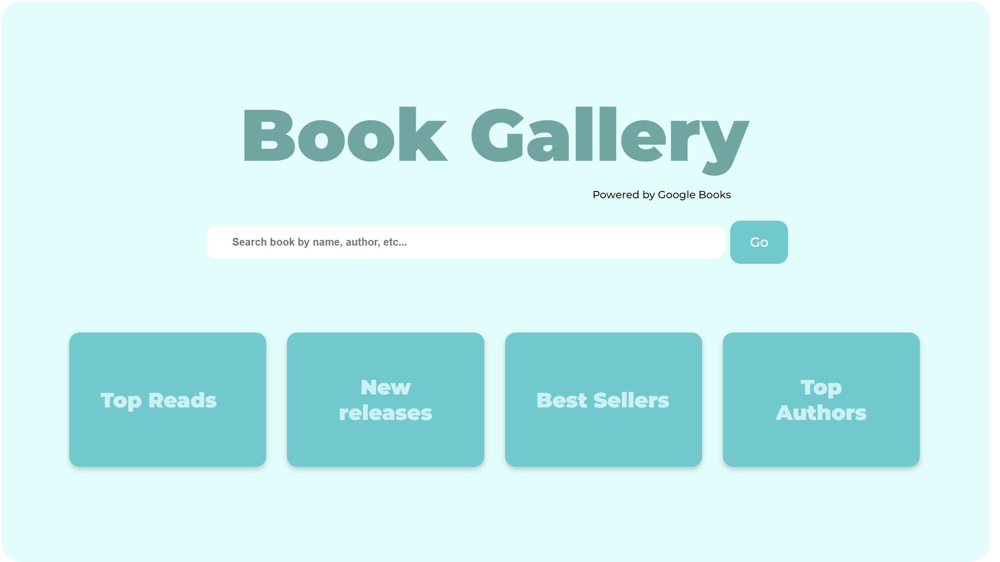
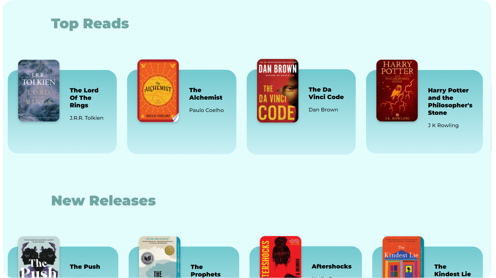

# book-library
<h3>📚 Find books from Google Books by <a href="https://github.com/CodePrakhar">Prakhar Mani Tripathi</a></h3>

<h3>✨ Features</h3>

❤️ Minimal and Lightweight: Crafted with minimalistic UI design

⚡ Click N Read: Click on any book to read it in Google Books!

🔌 Search your Favs: Search books by name, author, genre etc...

⭐ Collection of curated books just for you!

<h2>Tech Stacks Used</h2>

💪 HTML: For Web Framework

🔥 CSS: For Styling

🪄 JQuery: 'Cause it's magic

📚 Google Books API: To fetch the book data

<h2>Specification</h2>
The website contains sections like- Top Authors, Best-Sellers, etc; containing curated books just for you.

The minimalistic UI uses flexbox to display the books in form of cards which arrange themselves as per the screen size.
